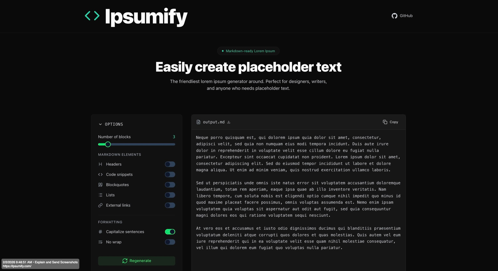

# Ipsumify

[](https://nuxt.com/)
[](https://ui.nuxt.com/)
[](https://tailwindcss.com/)
[](https://www.typescriptlang.org/)
[](https://opensource.org/licenses/MIT)
[](https://app.netlify.com/projects/ipsumify/deploys)

## Easily Create Placeholder Text

> The friendliest lorem ipsum generator around. Perfect for designers, writers, and anyone who needs placeholder text.



## Features

- **Markdown-Ready Output** - Generate lorem ipsum with headers, code blocks, blockquotes, lists, and links
- **Customizable Blocks** - Control the number of text blocks (1-20)
- **Formatting Options** - Toggle capitalization and no-wrap mode for cleaner copy-paste
- **One-Click Actions** - Copy to clipboard or download as `.md` file
- **Dark Theme** - Beautiful dark UI optimized for developers and designers
- **Fully Accessible** - 100% Lighthouse accessibility score
- **SEO Optimized** - Built-in sitemap, robots.txt, and meta tags

## Tech Stack

| Technology                                    | Version | Description                                |
| --------------------------------------------- | ------- | ------------------------------------------ |
| [Nuxt](https://nuxt.com/)                     | 4.x     | Vue.js meta-framework with SSR/SSG support |
| [Nuxt UI](https://ui.nuxt.com/)               | 4.x     | Beautiful UI component library             |
| [Tailwind CSS](https://tailwindcss.com/)      | 4.x     | Utility-first CSS framework                |
| [TypeScript](https://www.typescriptlang.org/) | 5.x     | Type-safe JavaScript                       |
| [@nuxtjs/seo](https://nuxtseo.com/)           | 3.x     | SEO module with sitemap and robots.txt     |
| [Lucide Icons](https://lucide.dev/)           | -       | Beautiful open-source icons                |

## Getting Started

### Prerequisites

- Node.js 20.x or higher (see `.nvmrc`)
- Yarn 1.22.x (or npm/pnpm)

### Installation

```bash
# Clone the repository
git clone https://github.com/ICJIA/ipsumify-next-2026.git
cd ipsumify-next-2026

# Install dependencies
yarn install

# Start development server
yarn dev
```

The app will be available at `http://localhost:3000`.

### Available Scripts

| Command            | Description                                     |
| ------------------ | ----------------------------------------------- |
| `yarn dev`         | Start development server with hot reload        |
| `yarn build`       | Build for production (SSR)                      |
| `yarn generate`    | Generate static site for deployment             |
| `yarn preview`     | Preview production build locally                |
| `yarn postinstall` | Prepare Nuxt (runs automatically after install) |

## Project Structure

```
ipsumify/
├── app/                    # Nuxt 4 app directory
│   ├── app.vue             # Root component
│   ├── assets/
│   │   └── css/
│   │       └── main.css    # Global styles and Tailwind imports
│   └── pages/
│       └── index.vue       # Main page component
├── public/
│   └── icon.svg            # Favicon
├── app.config.ts           # App configuration (theme colors)
├── nuxt.config.ts          # Nuxt configuration
├── package.json            # Dependencies and scripts
└── tsconfig.json           # TypeScript configuration
```

## Configuration

### Theme Colors

Edit `app.config.ts` to customize the primary and neutral colors:

```typescript
export default defineAppConfig({
  ui: {
    colors: {
      primary: "teal", // Primary accent color
      neutral: "zinc", // Neutral/gray color
    },
  },
});
```

### SEO Settings

Edit the `site` configuration in `nuxt.config.ts`:

```typescript
site: {
  url: 'https://your-domain.com',
  name: 'Your App Name',
  description: 'Your app description',
  defaultLocale: 'en'
}
```

## Deployment

### Netlify (Recommended)

The project includes a `netlify.toml` configuration for easy deployment:

1. Connect your repository to Netlify
2. Netlify will automatically detect the build settings
3. Deploy!

### Manual Static Deployment

```bash
# Generate static files
yarn generate

# The output will be in .output/public/
# Deploy this folder to any static hosting service
```

## Accessibility & Quality Scores

### Lighthouse

| Category       | Score |
| -------------- | ----- |
| Accessibility  | 100   |
| Best Practices | 100   |
| SEO            | 100   |

### axe-core

| Metric     | Result |
| ---------- | ------ |
| Violations | 0      |
| Passes     | 37     |

## Contributing

Contributions are welcome! Please feel free to submit a Pull Request.

1. Fork the repository
2. Create your feature branch (`git checkout -b feature/amazing-feature`)
3. Commit your changes (`git commit -m 'Add some amazing feature'`)
4. Push to the branch (`git push origin feature/amazing-feature`)
5. Open a Pull Request

## License

This project is licensed under the MIT License - see the [LICENSE](LICENSE) file for details.

## Acknowledgments

- [Nuxt](https://nuxt.com/) - The intuitive Vue framework
- [Nuxt UI](https://ui.nuxt.com/) - Beautiful UI components
- [Tailwind CSS](https://tailwindcss.com/) - Utility-first CSS
- [Lucide](https://lucide.dev/) - Beautiful open-source icons
